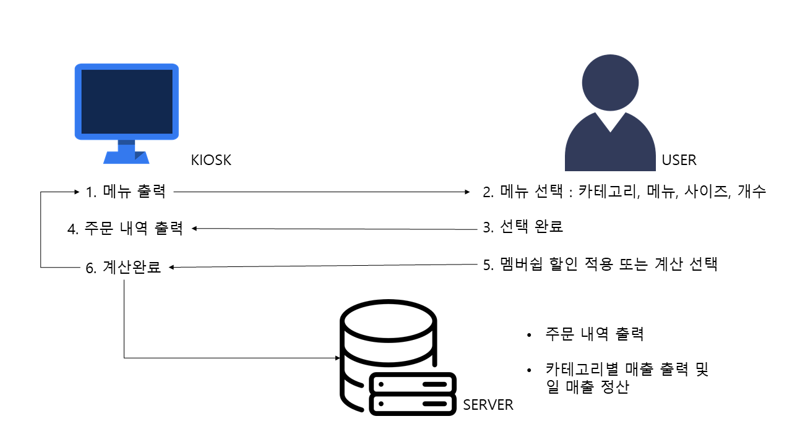
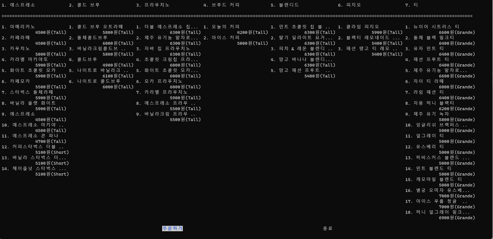
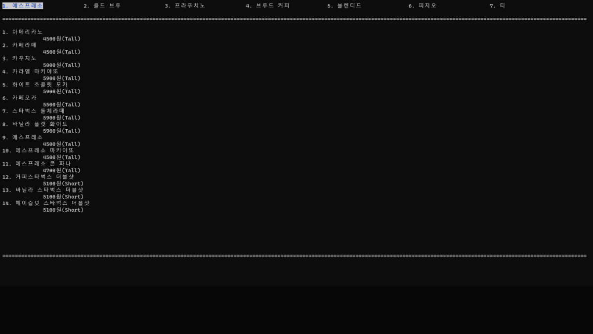
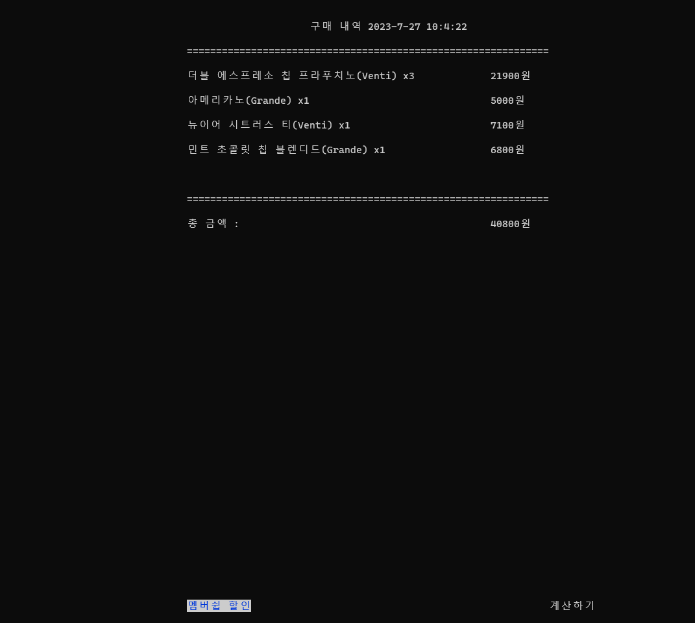
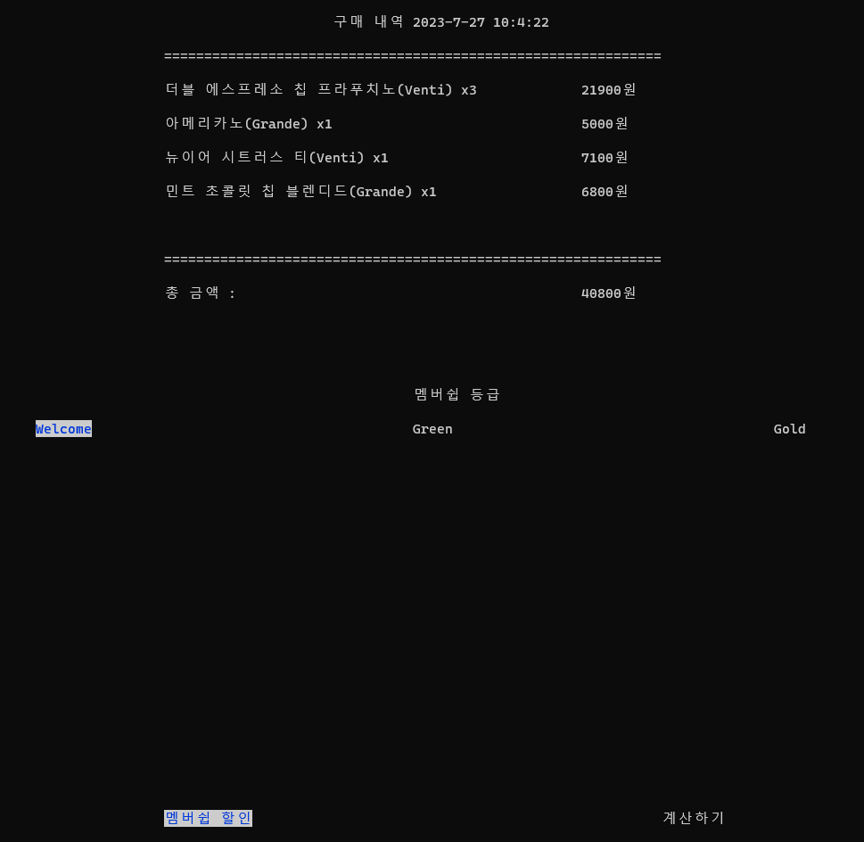
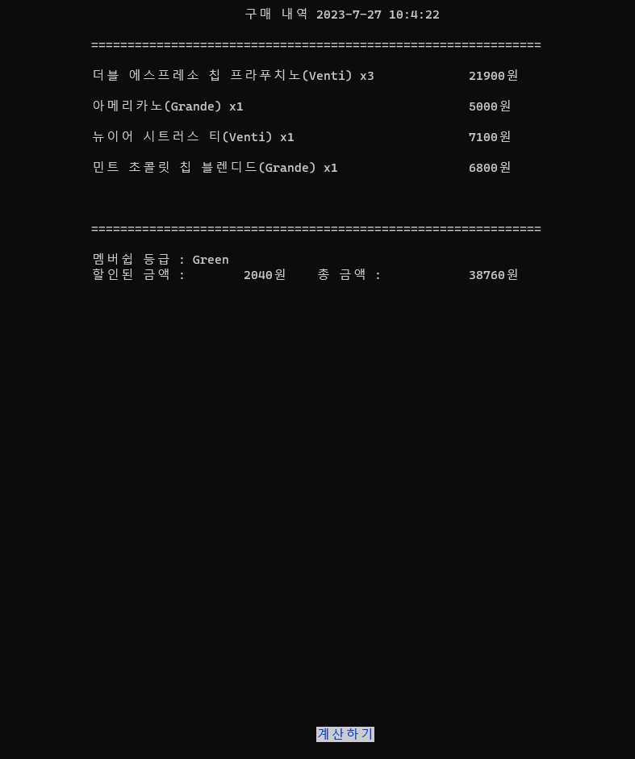
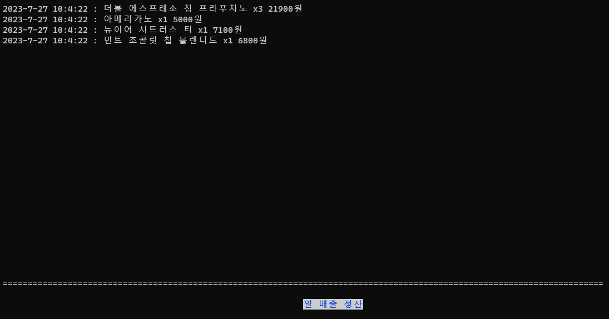
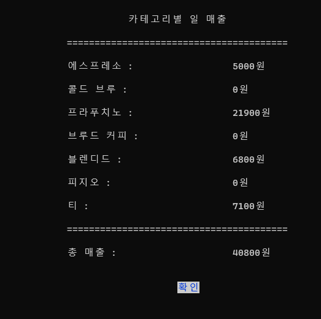

# My STARBUCKS Kiosk
C로 만든 TOY 프로젝트 


## 1. 개발 기간 및 참여 인원

+ 2023.07.21. ~ 2023.07.27.

+ 개인 프로젝트

## 2. 기술 스택 및 개발 환경

+ Ubuntu 22.04.2 LTS
+ C (컴파일러 gcc 11.3.0)
+ NCURSES 
    ```
    sudo apt-get install libncurses5-dev libncursesw5-dev 
    ```

## 3. 프로그램 실행 방법

```bash
$ make clean 
$ make all
$ ./server <포트번호>
$ ./client <ip주소> <포트번호>
```

## 4. 핵심 기능

### 4.1. OVERVIEW


### 4.2. Client

4.2.1. 메뉴 출력 [menu.c](./src/menu.c)
<details> 
<summary> Kiosk 화면에 전체 메뉴를 출력한다. </summary>



</details>

---
4.2.2 메뉴 선택 [order.c](./src/order.c)
<details> 
<summary> 사용자가 Kiosk에서 카테고리, 메뉴, 사이즈와 개수를 선택한다. 사용자가 선택한 메뉴와 사이즈, 개수를 화면 아래에 출력하여 보여준다.</summary>



사용자가 주문한 정보를 저장할 배열(=장바구니)

```C
int order_cnt=0; // 사용자가 선택한 메뉴의 총 개수
char* order_name[100]; // 사용자가 선택한 메뉴의 이름
int order_price[100]; // 사용자가 선택한 메뉴의 가격
int order_num[100]; // 사용자가 선택한 메뉴의 개수
int order_size[100]; // 사용자가 선택한 메뉴의 사이즈
```

</details>

---
4.2.3 주문 내역 출력 [payment.c](./src/payment.c)

<details> 
<summary> 주문 내역을 출력하여 보여준다. 사용자는 멤버쉽 할인을 적용할지 말지를 선택할 수 있다.</summary>



</details>

---
 4.2.4 멤버쉽 할인 [payment.c](./src/payment.c)

<details>
<summary> 멤버쉽 등급을 선택할 수 있고 등급에 따른 할인 내역이 다르다.
</summary>


</details>

<details>
<summary> 할인된 금액과 할인이 적용된 총 금액을 다시 출력하여 보여준다.</summary>



</details>

사용자가 계산을 완료할 때마다 서버로 주문 내역을 전송한다.

---

### 4.3. Server

4.3.1 주문 히스토리 [server_init.c](./src/server_init.c)

<details>
<summary> 사용자가 계산 완료한 주문 내역을 출력한다.</summary>



</details>

---
4.3.2 카테고리 매출 확인 및 일 매출 정산  [server_init.c](./src/server_init.c)
<details>
<summary> 사용자들이 구매했던 메뉴들을 카테고리 별로 매출과 하루 매출을 정산하여 보여준다.</summary>



```C
int category_sales[7]; // 카테고리별 매출을 저장
static int sales[12][31]; // 일 매출 저장 [month][day]
```

</details>

## 5. 오류 및 개선 사항

* 클라이언트 실행 시 여러 메뉴를 선택하여 장바구니에 담고 계산을 하려고 하면 가끔씩 "세그멘테이션 오류"가 발생

* 절차적인 프로세스로 인해 키오스크에서 주문을 여러 번 완료하면 서버 프로세스에서 주문 내역 출력이 완벽하지 않음

  --> 멀티스레드 사용으로 개선 가능

* 영구적인 데이터 저장이 불가능하기 때문에 서버가 종료되면 일 매출을 저장한 배열이 초기화

  --> DB 연동으로 개선 가능

---

Contact : <iyhs1858@gmail.com> 


